# Leonardo Visual Demos

A portable gallery of 13 visual high-performance computing demonstrations for public engagement. Each demo separates headless scientific computation from presentation: the solver writes numbered frames and metadata, while a lightweight web viewer handles playback, controls, readouts, and saved runs.

The previews below were generated with the `desktop` profile using **150 simulation frames per demo**. Array solvers used CuPy/CUDA where supported, neural demos used PyTorch/CUDA, and CPU-native demos used NumPy.

## Demo gallery

<table>
  <tr>
    <td width="50%">
      <strong>Black-hole lensing</strong><br>
      Image-space gravitational lensing with a numerical 3D photon-path view.<br><br>
      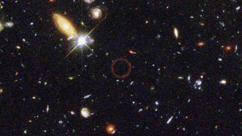
    </td>
    <td width="50%">
      <strong>Primordial black-hole threshold</strong><br>
      A reduced radial model exploring the boundary between collapse and dispersion.<br><br>
      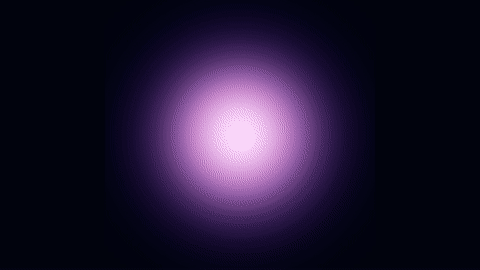
    </td>
  </tr>
  <tr>
    <td>
      <strong>Virtual wind tunnel</strong><br>
      D2Q9 lattice-Boltzmann flow with advected streaklines and configurable obstacles.<br><br>
      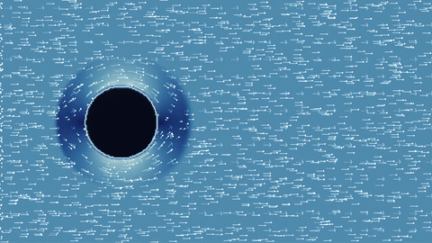
    </td>
    <td>
      <strong>Cosmic-web formation</strong><br>
      Particle-mesh gravity with expanding-space and gas-composition comparisons.<br><br>
      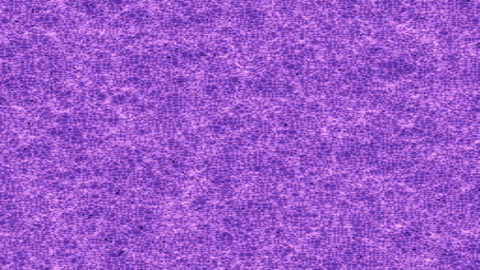
    </td>
  </tr>
  <tr>
    <td>
      <strong>Milky Way–Andromeda collision</strong><br>
      Restricted N-body evolution using physical mass and encounter parameters.<br><br>
      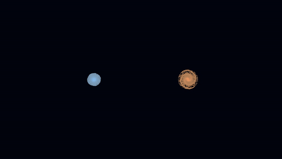
    </td>
    <td>
      <strong>Galaxy collision: full 3D gravity</strong><br>
      Direct softened all-pairs gravity over massive disc, bulge, and halo particles.<br><br>
      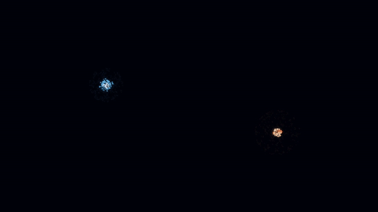
    </td>
  </tr>
  <tr>
    <td>
      <strong>Living mathematics</strong><br>
      Gray–Scott reaction-diffusion evolving from a seed into an emergent pattern.<br><br>
      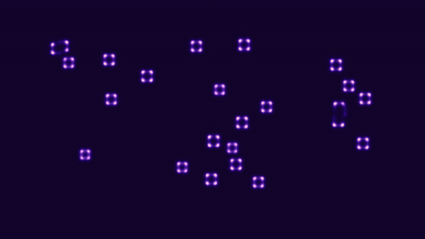
    </td>
    <td>
      <strong>Crystal growth</strong><br>
      Recursive anisotropic growth with multiple habits and effectively unbounded deep zoom.<br><br>
      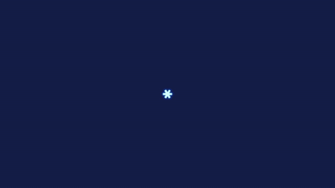
    </td>
  </tr>
  <tr>
    <td>
      <strong>Neural-network wall</strong><br>
      A real batched coordinate-network training workload that reveals many networks at once.<br><br>
      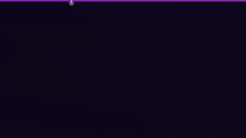
    </td>
    <td>
      <strong>Star in a Bottle</strong><br>
      A reduced nonlinear plasma-wave lattice projected onto a rotatable tokamak torus.<br><br>
      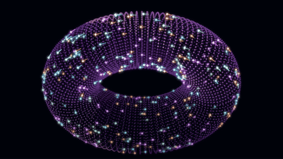
    </td>
  </tr>
  <tr>
    <td>
      <strong>AI Plasma Guardian</strong><br>
      A trainable neural controller learns to suppress a reduced plasma instability.<br><br>
      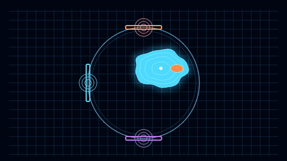
    </td>
    <td>
      <strong>Storm Factory</strong><br>
      A barotropic-vorticity atmosphere turns small initial uncertainty into diverging forecasts.<br><br>
      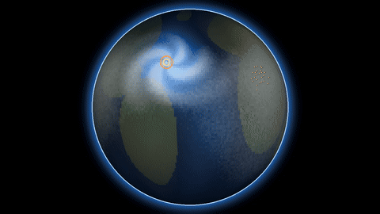
    </td>
  </tr>
  <tr>
    <td>
      <strong>Molecular Machine</strong><br>
      Coarse-grained 3D molecular dynamics with all-pairs interactions and ensemble comparisons.<br><br>
      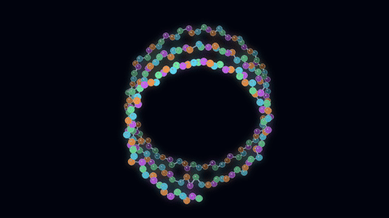
    </td>
    <td>
      <strong>One viewer, three compute settings</strong><br>
      The same demo contract runs locally, on a CUDA desktop, or headlessly under SLURM on Leonardo. Completed runs can be replayed without recomputation.
    </td>
  </tr>
</table>

## Run locally

Python 3.10 or newer is required.

```bash
python -m venv .venv
# Windows: .venv\Scripts\activate
# macOS/Linux: source .venv/bin/activate
pip install -r requirements.txt
python app.py
```

Open the address printed by the server, normally `http://127.0.0.1:8000`. On Windows, `Run_Leonardo_Demos.bat` provides a simple demo menu.

To generate an individual run directly:

```bash
python run_demo.py reaction_diffusion --profile desktop --frames 150
```

## Recreate this showcase

The showcase command is resumable: complete runs are reused and missing or incomplete demos are rendered again. GIF creation requires `ffmpeg` on `PATH`.

```bash
python scripts/generate_showcase.py
```

Raw runs are stored under `runs/showcase_desktop_150/`; the README-ready animations are written to `docs/assets/demos/`. Use `--demo DEMO_ID` to process one demo or `--force` to rerender completed runs.

## Leonardo workflow

Leonardo jobs run headlessly through the templates in `slurm/`; generated frames and metadata are then synchronised to the presentation machine for live playback or a clearly labelled saved-run fallback. Start with [the Leonardo guide](docs/LEONARDO.md), then use the included preflight, submission, and sync scripts.

These are public-engagement demonstrators rather than production research solvers. Model assumptions and limitations are documented in [the scientific notes](docs/SCIENTIFIC_NOTES.md), with per-demo detail under [`docs/demos/`](docs/demos/README.md).
